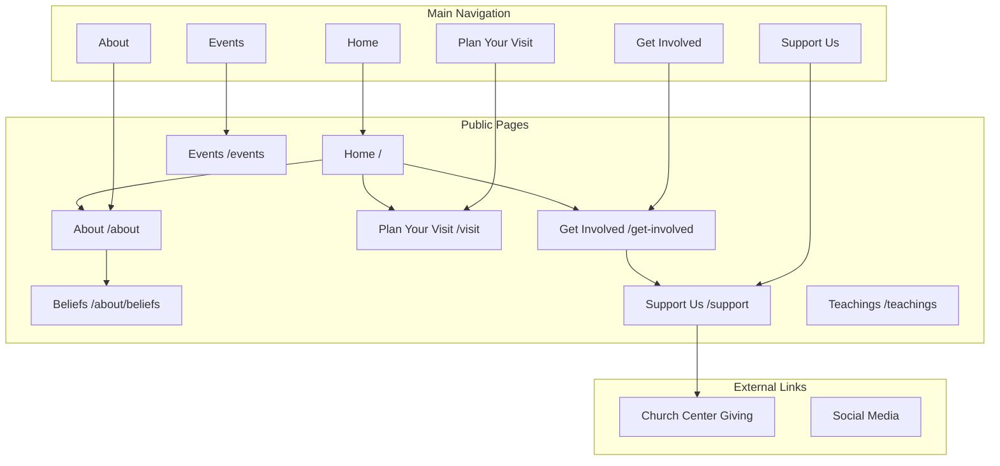

# Product Requirements Document (PRD)
## Vertical Church Website

### Overview

The Vertical Church website is a modern, responsive church website designed to serve the congregation and community of Vertical Church located in North Ridgeville, Ohio. The website aims to communicate the church's mission, connect visitors with church life, and provide access to teachings and resources.

---

### Mission Statement

> "We exist to glorify God through the fulfillment of the Great Commission in the spirit of the Great Commandment."

The mission is **unashamedly unoriginal** — because it's not theirs to come up with. Jesus laid out the mission for His church 2,000 years ago:

- **The Great Commission** (Matthew 28:19–20): "Go therefore and make disciples of all nations, baptizing them in the name of the Father and of the Son and of the Holy Spirit, teaching them to observe all that I have commanded you."
- **The Great Commandment** (Matthew 22:37–40): "You shall love the Lord your God with all your heart and with all your soul and with all your mind... You shall love your neighbor as yourself."

---

### Vision

> "Our vision is to be a church that is faithfully committed to making more disciples and stronger disciples of Jesus Christ with an effective witness and mutual ministry."

---

### Our Pillars

The four pillars that define Vertical Church's ministry approach:

| Pillar | Description | Scripture |
|--------|-------------|-----------|
| **Unapologetic Preaching** | Proclaiming the authority of God's Word without apology | 2 Timothy 4:2 |
| **Unashamed Worship** | Lifting high the name of Jesus through worship | John 4:24 |
| **Unceasing Prayer** | Believing firmly in the power of prayer | Ephesians 6:18 |
| **Unafraid Witness** | Sharing the good news of Jesus with boldness | Ephesians 6:19–20 |

---

### Our Principles

Vertical Church makes disciples of Jesus by encouraging them to:

| Principle | Description |
|-----------|-------------|
| **Worship Christ** | God's Word admonishes us to worship together regularly. We worship together as a community through music, prayer, and the preaching of God's Word every weekend. |
| **Walk with Christ** | Growing in your walk with Christ is best achieved in rich community. The Vertical Church family encourages everyone to join a Small Group where you experience fellowship, applicational study in God's Word, and mutual ministry. |
| **Work for Christ** | One of the great joys of being a disciple of Christ is by serving Christ and one another. We encourage all those in the Vertical Church family to use their time, energy, and talents to build the Kingdom of God and care for one another. |
| **Witness for Christ** | Sharing the Good News about Jesus Christ is a vital aspect in the life of a growing disciple. At Vertical Church we encourage believers to share the Gospel with those around us in loving and intentional ways. |

---

### Target Audience

1. **Current Members** - Access teachings, event information, small groups, and giving
2. **Visitors & Seekers** - Learn about the church, plan a visit, understand beliefs
3. **New Believers** - Find resources to grow in faith, connect with community
4. **Community** - Discover outreach opportunities and church events

---

### Core Objectives

1. **Communicate Identity** - Clearly present who Vertical Church is and what they believe
2. **Facilitate Connection** - Make it easy for visitors to plan a visit and get connected
3. **Provide Resources** - Deliver teachings, sermons, and spiritual growth content
4. **Enable Engagement** - Support giving, small group sign-ups, and ministry involvement
5. **Showcase Community** - Display the vibrant church life through imagery and testimonials

---

### Site Structure Overview

The following diagram illustrates the primary user-facing pages and their relationships:

---

### Key Pages

| Page | Purpose |
|------|---------|
| **Home** | Primary landing page with hero, welcome message, ministry highlights, and calls-to-action |
| **About** | Church history, mission, pillars, principles, vision, and leadership team |
| **About > Beliefs** | Detailed doctrinal statements and theological positions |
| **Plan Your Visit** | Service times, location, what to expect, FAQ for first-time visitors |
| **Get Involved** | Ministries, next steps (salvation, baptism), small groups, and serving opportunities |
| **Events** | Upcoming church events, calendar, and event registration |
| **Support Us** | Online giving information and donation portal |
| **Teachings** | Sermon archive with latest teaching, series, and filterable teaching library |

---

### Primary User Journey Pages

The website focuses on two primary user journeys for visitors:

#### 1. Plan Your Visit (`/visit`)
For first-time visitors exploring the church:
- Service times and location
- What to expect on a Sunday
- Children's check-in information
- FAQ section
- Plan a visit form

#### 2. Get Involved (`/get-involved`)
For those ready to take their next step in faith and community:
- **Next Steps Section**: Salvation and baptism information
- **Ministries Section**: All church ministries with descriptions
- **Small Groups Section**: Community groups for connection and growth
- **Serve Section**: Opportunities to serve on a team

---

### Get Involved Page Details

The Get Involved page serves as the central hub for deeper engagement with the church community. It includes the following sections:

#### Next Steps
A pathway for spiritual growth:

| Step | Description |
|------|-------------|
| **I Said Yes to Jesus** | Resources and next steps for those who have made a decision to follow Christ. Includes information about what it means to be saved and how to grow in faith. |
| **Get Baptized** | Information about water baptism as an outward declaration of faith. Includes sign-up form and explanation of baptism's significance. Scripture: Acts 22:16, Romans 6:3-4 |
| **Read God's Word** | Encouragement to engage with Scripture daily. Links to Bible reading plans and resources. |
| **Talk with God** | Teaching on prayer and its importance in a relationship with God. |

#### Ministries
All church ministries with descriptions and contact information:

| Ministry | Description | Target Audience |
|----------|-------------|-----------------|
| **Small Groups** | Weekly gatherings of 5-12 people meeting in homes to discuss Scripture, build relationships, and support one another | All adults |
| **Worship Service** | Weekend services featuring unapologetic preaching and unashamed worship | Everyone |
| **Children's Ministry** | Age-appropriate Bible teaching and activities for kids (birth through 5th grade) | Families with children |
| **Student Ministry** | Middle and high school students gathering for worship, teaching, and community | Students grades 6-12 |
| **Women's Ministry** | Bible studies, events, and community for women | Women |
| **Men's Ministry** | Bible studies, events, and fellowship for men | Men |

#### Small Groups
Dedicated section highlighting the importance of community:
- Description of what small groups are and why they matter
- How to find and join a group
- Current groups with meeting times/locations
- Sign-up form or link to group finder

#### Serve on a Team
Opportunities to use gifts and talents to serve:

| Team | Description |
|------|-------------|
| **Guest Services** | Welcome and assist guests, parking, hospitality |
| **Worship Team** | Music, vocals, production |
| **Kids Team** | Serve in children's ministry |
| **Student Team** | Serve in student ministry |
| **Tech Team** | Audio, video, lighting, live stream |
| **Creative Team** | Design, photography, social media |

---

### Functional Requirements

#### Navigation & Structure
- Responsive header with logo, main navigation, and "Plan a Visit" CTA
- Sticky/fixed navigation on scroll
- Mobile hamburger menu with full navigation
- Comprehensive footer with organized links and social media

#### Content Management
- Sermon/teaching upload and management
- Series organization and categorization
- Staff/leadership profile management
- Event management system
- Blog/article publishing capability

#### User Features
- Teaching video playback (embedded player)
- Teaching filtering by series, book, pastor, and year
- Search functionality
- Plan a visit form
- Contact forms
- Online giving integration
- Shop/e-commerce functionality

#### Visual & UX
- Dynamic image collages/mosaics
- Horizontal scrolling ministry carousels
- Animated text marquee effects
- Responsive design (mobile-first)
- Consistent brand application

---

### Technical Requirements

- **Framework**: Modern JavaScript framework (React/Next.js recommended)
- **Styling**: CSS-in-JS or Tailwind CSS
- **CMS**: Headless CMS for content management
- **Video**: YouTube/Vimeo embed or custom video player
- **Hosting**: Fast, reliable hosting with CDN
- **Analytics**: Google Analytics or similar
- **SEO**: Server-side rendering or static generation for SEO
- **Performance**: Core Web Vitals optimization

---

### Success Metrics

1. Increase in online visitor engagement (time on site, pages per session)
2. Growth in "Plan a Visit" form submissions
3. Increase in online giving participation
4. Higher sermon/teaching engagement (views, completion rates)
5. Small group sign-up conversions
6. Mobile user experience satisfaction

---

### Timeline & Phases

**Phase 1: Foundation**
- Core pages (Home, About, Contact)
- Responsive design implementation
- Basic navigation and footer

**Phase 2: Content**
- Teachings page with video integration
- Series and filtering functionality
- CMS integration

**Phase 3: Engagement**
- Plan a visit functionality
- Small groups integration
- Giving portal

**Phase 4: Extended**
- Shop/e-commerce
- Events system
- Member portal (future consideration)

---

### Stakeholders

- Church Leadership
- Communications Team
- Ministry Leaders
- Web Development Team
- Content Creators

---

*Document Version: 1.0*
*Last Updated: January 2026*
