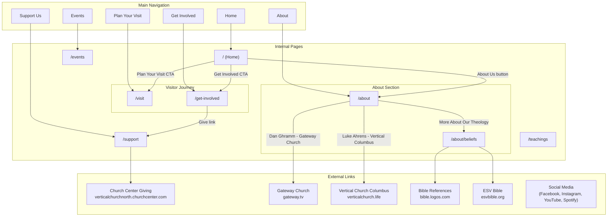
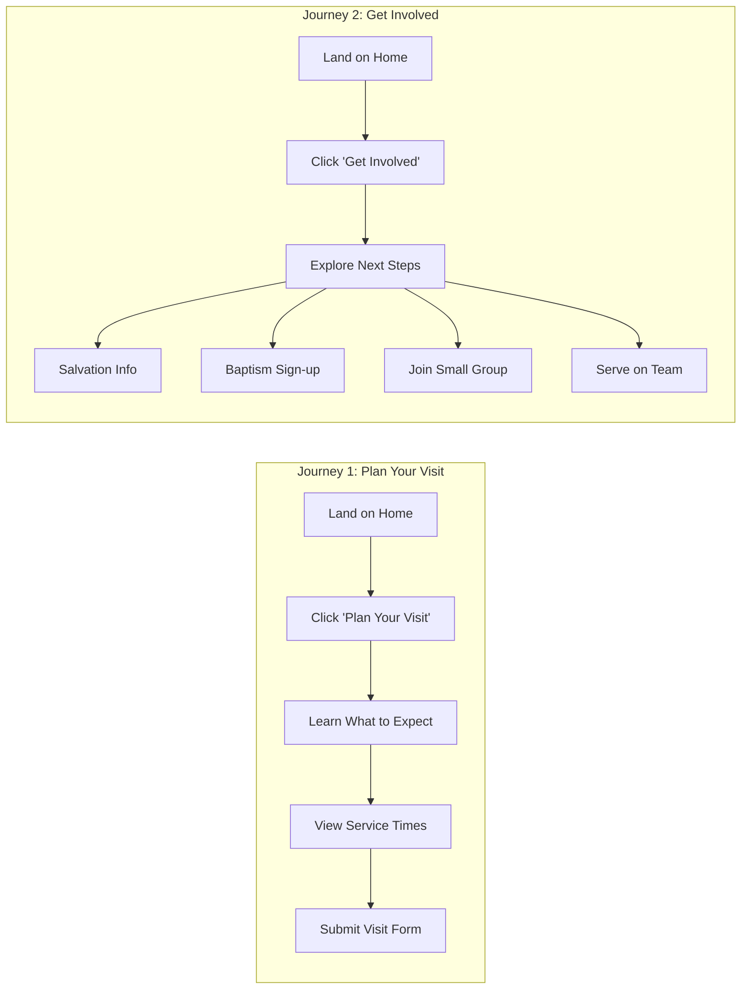
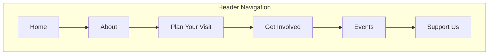
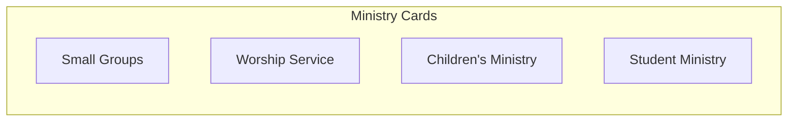
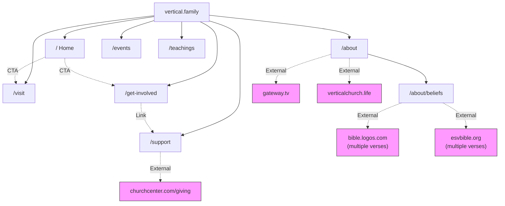

# Vertical Church Website - Site Structure

This document maps all pages and links for the Vertical Church website.

## Planned Site Map

## User Journey Diagram

The two primary user journeys for visitors:

## Page Inventory

### Internal Pages

| Page | URL | Description | Status |
|------|-----|-------------|--------|
| Home | `/` | Main landing page with welcome message, service times, ministry cards | Built |
| About | `/about` | Church principles, history, mission, leadership team, pillars | Built |
| Beliefs | `/about/beliefs` | Detailed doctrinal statements and theological positions | Planned |
| Plan Your Visit | `/visit` | Service times, what to expect, FAQ, visit form | Built |
| Get Involved | `/get-involved` | Next steps (salvation, baptism), ministries, small groups, serving | Planned |
| Events | `/events` | Upcoming church events, calendar, registration | Planned |
| Support Us | `/support` | Online giving information and donation options | Planned |
| Teachings | `/teachings` | Sermon archive, series, filterable library | Planned |

### Get Involved Page Sections

| Section | Content |
|---------|---------|
| **Next Steps** | Salvation information, baptism sign-up, spiritual growth resources |
| **Ministries** | Small Groups, Children's Ministry, Student Ministry, Women's/Men's Ministry |
| **Small Groups** | Group finder, descriptions, sign-up form |
| **Serve** | Guest Services, Worship Team, Kids Team, Tech Team, Creative Team |

### External Links

| Destination | URL | Context |
|-------------|-----|---------|
| Church Center Giving | `verticalchurchnorth.churchcenter.com/giving` | "Support Us" button in navigation |
| Gateway Church | `gateway.tv` | Partner church - Elder Dan Ghramm |
| Vertical Church Columbus | `verticalchurch.life` | Partner church - Elder Luke Ahrens |
| Bible Logos | `bible.logos.com` | Scripture reference links on Beliefs page |
| ESV Bible | `esvbible.org` | Scripture reference links on Beliefs page |

## Navigation Structure

## Ministry Sections (Home Page)

The home page features four ministry cards that appear in the footer area of multiple pages:

> **Note:** These ministry cards appear as visual elements but do not currently link to dedicated pages on the site.

## Complete Link Hierarchy

## Summary

**Total Internal Pages:** 8
- Home (`/`)
- About (`/about`)
- Beliefs (`/about/beliefs`)
- Plan Your Visit (`/visit`)
- Get Involved (`/get-involved`)
- Events (`/events`)
- Support Us (`/support`)
- Teachings (`/teachings`)

**Primary User Journey Pages:** 2
- Plan Your Visit - For first-time visitors
- Get Involved - For deeper engagement (ministries, next steps, small groups)

**Total External Link Destinations:** 6
- Church Center Giving (donations)
- Gateway Church (partner church)
- Vertical Church Columbus (partner church)
- Bible Logos (scripture references)
- ESV Bible (scripture references)
- Social Media (Facebook, Instagram, YouTube, Spotify)

**Navigation Items:** 6 (Home, About, Plan Your Visit, Get Involved, Events, Support Us)

**Ministry Sections:** 6 (Small Groups, Worship Service, Children's Ministry, Student Ministry, Women's Ministry, Men's Ministry)
