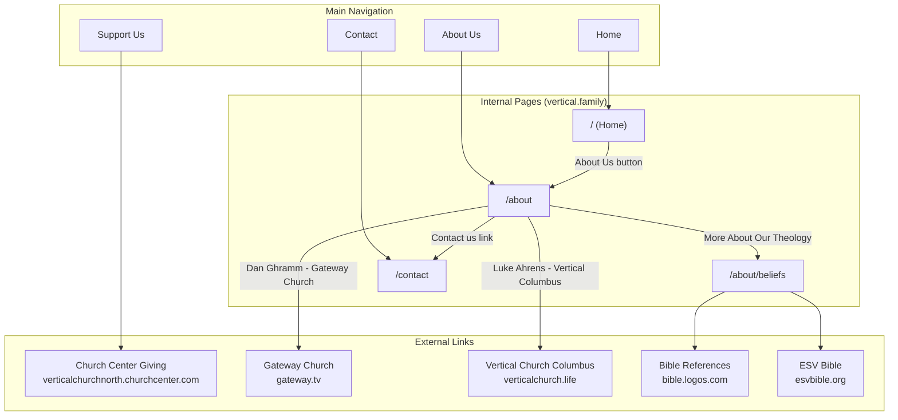
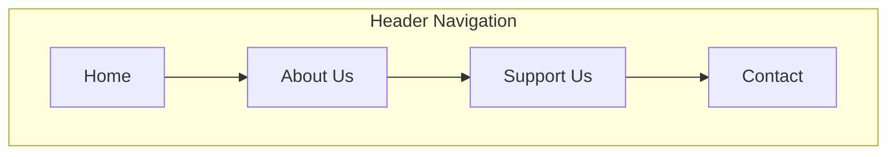
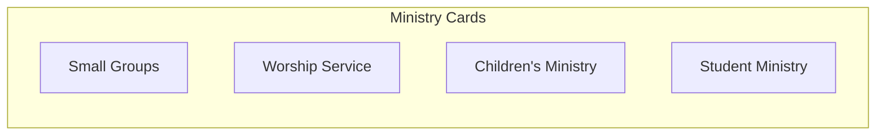
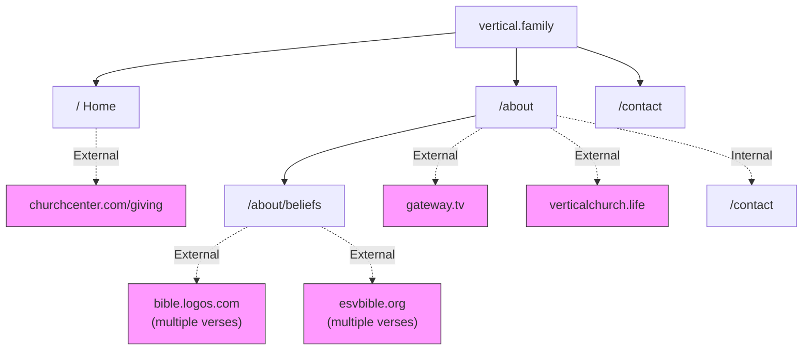

# Vertical Church Website - Site Structure

This document maps all pages and links found on the live site at [vertical.family](https://www.vertical.family/).

## Site Map Diagram

## Page Inventory

### Internal Pages

| Page | URL | Description |
|------|-----|-------------|
| Home | `/` | Main landing page with welcome message, service times, ministry cards |
| About | `/about` | Church principles, history, mission, leadership team, pillars |
| Beliefs | `/about/beliefs` | Detailed doctrinal statements and theological positions |
| Contact | `/contact` | Contact form, address, phone number, visiting info |

### External Links

| Destination | URL | Context |
|-------------|-----|---------|
| Church Center Giving | `verticalchurchnorth.churchcenter.com/giving` | "Support Us" button in navigation |
| Gateway Church | `gateway.tv` | Partner church - Elder Dan Ghramm |
| Vertical Church Columbus | `verticalchurch.life` | Partner church - Elder Luke Ahrens |
| Bible Logos | `bible.logos.com` | Scripture reference links on Beliefs page |
| ESV Bible | `esvbible.org` | Scripture reference links on Beliefs page |

## Navigation Structure

## Ministry Sections (Home Page)

The home page features four ministry cards that appear in the footer area of multiple pages:

> **Note:** These ministry cards appear as visual elements but do not currently link to dedicated pages on the site.

## Complete Link Hierarchy

## Summary

**Total Internal Pages:** 4
- Home (`/`)
- About (`/about`)
- Beliefs (`/about/beliefs`)
- Contact (`/contact`)

**Total External Link Destinations:** 5
- Church Center Giving (donations)
- Gateway Church (partner church)
- Vertical Church Columbus (partner church)
- Bible Logos (scripture references)
- ESV Bible (scripture references)

**Navigation Items:** 4 (Home, About Us, Support Us, Contact)

**Ministry Sections (non-linked):** 4 (Small Groups, Worship Service, Children's Ministry, Student Ministry)
